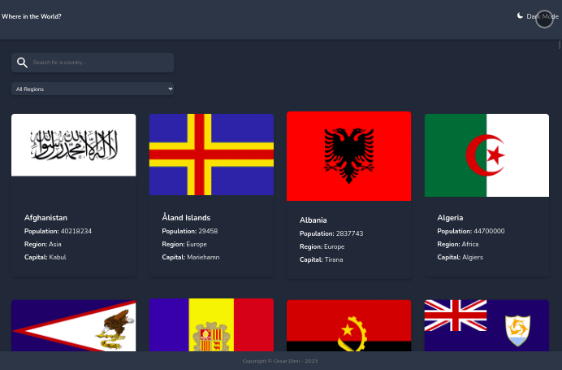
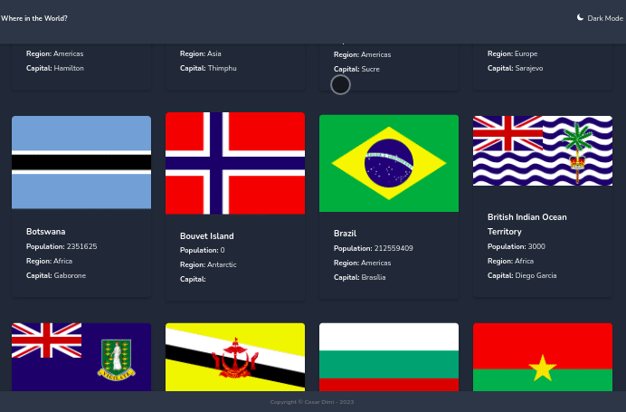

# rest-countries-api (Countires Data)

<p> The project has been developed with React and NextJs to query data from the REST Countries API. It features a responsive design, a display grid, and a toggle theme option with a dark mode. This website provides an easy and user-friendly way to access and analyze information from the REST Countries API.</p>

## preview
- Home page



<br>

- Detail page



## features
- [x] Integrating with the REST Countries API to pull countries data.
- [x] See all countries from the API on the homepage.
- [x] Search for a country using an input field.
- [x] Filter countries by region.
- [x] Click on a country to see more detailed information on a separate page.
- [x] Click through to the border countries on the detail page.
- [x] Toggle the color scheme between light and dark mode.


## [>>  DEPLOY  <<](https://rest-countries-api-cesardmn.vercel.app/)


## cloning and running 

- require NodeJs v16.+

clone and intstall:
```bash
$ git clone https://github.com/cesardmn/rest-countries-api.git
$ cd rest-countries-api
$ npm i
```

run:
```bash
$ npm run dev
```

<br>
<br>

## Developed by Cesar Dimi.
[](https://www.linkedin.com/in/cesardmn/)
[](https://wa.me/5521982399315)

<br>
<br>


### [ * Inspired by frontendmentor.](https://www.frontendmentor.io/challenges/rest-countries-api-with-color-theme-switcher-5cacc469fec04111f7b848ca)
